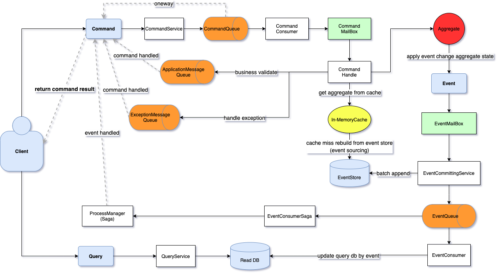

# ENode
ENode是一个基于【DDD】【CQRS】【ES】【EDA】【In-Memory】架构风格的应用框架


## 框架特色

> https://www.cnblogs.com/netfocus/p/5401179.html

 - 一个DDD开发框架，完美支持基于六边形架构思想的开发
 - 实现CQRS架构思想，并且框架提供C端命令的处理结果的返回，支持同步返回和异步返回
 - 内置Event Sourcing（ES）架构模式，让C端的数据持久化变得通用化
 - 聚合根常驻内存，in-memory domain model
 - 聚合根的处理基于Command Mailbox, Event Mailbox的思想，类似Actor Model, Actor Mailbox
 - 严格遵守聚合内强一致性、聚合之间最终一致性的原则
 - Group Commit Domain event
 - 基于聚合根ID+事件版本号的唯一索引，实现聚合根的乐观并发控制
 - 框架保证Command的幂等处理
 - 通过聚合根ID对命令或事件进行路由，做到最小的并发冲突、最大的并行处理
 - 消息发送和接收基于分布式消息队列EQueue，支持分布式部署
 - 基于事件驱动架构范式（EDA，Event-Driven Architecture）
 - 基于队列的动态扩容/缩容
 - EventDB中因为存放的都是不可变的事件，所以水平扩展非常容易，框架可内置支持
 - 支持Process Manager（Saga），以支持一个用户操作跨多个聚合根的业务场景，如订单处理，从而避免分布式事务的使用
 - ENode实现了CQRS架构面临的大部分技术问题，让开发者可以专注于业务逻辑和业务流程的开发，而无需关心纯技术问题

## 系统设计
> https://www.cnblogs.com/netfocus/p/3859371.html

补充：系统依赖注入的实现强耦合了Spring，目前只能在Spring项目中使用，参见Samples项目

## 注意点
### ICommandService sendAsync 和 executeAsync的区别
sendAsync只关注发送消息的结果

executeAsync发送消息的同时，关注命令的返回结果，返回的时机如下：
- CommandReturnType.CommandExecuted：命令执行完成，event发布成功后返回结果
- CommandReturnType.EventHandled：事件处理完成后才返回结果

### event使用哪个订阅者发送处理结果
event的订阅者可能有很多个，所以enode只要求有一个订阅者处理完事件后发送结果给发送命令的人即可，通过AbstractDomainEventListener中sendEventHandledMessage参数来设置是否发送，最终来决定由哪个订阅者来发送命令处理结果

### ICommandHandler和ICommandAsyncHandler区别
ICommandHandler是为了操作内存中的聚合根的，所以不会有异步操作，但后来ICommandHandler的Handle方法也设计为了HandleAsync了，目的是为了异步到底，否则异步链路中断的话，异步就没效果了
而ICommandAsyncHandler是为了让开发者调用外部系统的接口的，也就是访问外部IO，所以用了Async
ICommandHandler，ICommandAsyncHandler这两个接口是用于不同的业务场景，ICommandHandler.handleAsync方法执行完成后，框架要从context中获取当前修改的聚合根的领域事件，然后去提交。而ICommandAsyncHandler.handleAsync方法执行完成后，不会有这个逻辑，而是看一下handleAsync方法执行的异步消息结果是什么，也就是IApplicationMessage。

## 使用说明

### 编程方式
新增了三个注解，系统限定了只扫描@Command和@Event标识的类，执行的方法上需要添加@Subscribe注解
- @Command
- @Event
- @Subscribe

### Kafka配置 
https://kafka.apache.org/quickstart
```bash
bin/zookeeper-server-start.sh config/zookeeper.properties

bin/kafka-server-start.sh config/server.properties
```
### RocketMQ配置 
https://rocketmq.apache.org/docs/quick-start/
启动RocketMQ服务
```bash
nohup sh bin/mqnamesrv &

nohup sh bin/mqbroker -n 127.0.0.1:9876 &
```

### 分别顺序启动以下项目
 
- command-sender

Command端应用，用来接收请求，将请求发送到消息队列

- command-consumer

异步消费命令消息，将领域消息持久化才算是执行成功，命令的结果可以发送到命令发送时注册的监听器

- event-consumer

领域事件处理服务，事件可能会多次投递，所以需要消费端逻辑保证幂等消费

### 测试
http://localhost:8001/note/create?id=noteid&t=notetitle&c=commandid


## 参考项目
- https://github.com/tangxuehua/enode
- https://github.com/coffeewar/enode-master