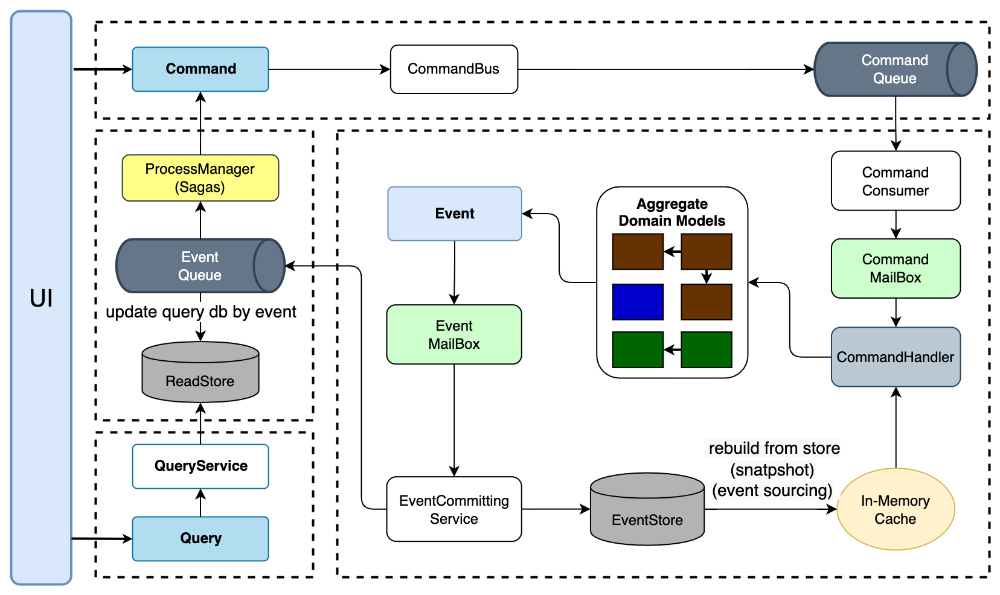

## 框架简介
`enode`是基于`JVM`平台，采用`Domain Driven Design`思想落地的一个`Open Source`应用框架，主要服务于云原生和微服务场景。

## 发版记录
[CHANGELOG](CHANGELOG.md)

## 整体架构

基于【`DDD`】【`CQRS`】【`ES`】【`EDA`】【`In-Memory`】架构风格，实现了`CQRS`架构面临的大部分技术问题，让开发者可以专注于业务逻辑和业务流程的开发，而无需关心纯技术问题。



## 使用约束
- **一个**命令只修改**一个**聚合根
- **聚合间**只能通过**领域消息**交互
- 聚合内**强一致性**
- 聚合间**最终一致性**

## `Saga`的两种模式
- 编排（`Choreography`）
参与者（子事务）之间的调用、分配、决策和排序，通过交换事件进行进行。是一种去中心化的模式，参与者之间通过消息机制进行沟通，通过监听器的方式监听其他参与者发出的消息，从而执行后续的逻辑处理。
> `enode`中使用的就是这种模式

- 控制（`Orchestration`）
提供一个控制类，方便参与者之间的协调工作。事务执行的命令从控制类发起，按照逻辑顺序请求`Saga`的参与者，从参与者那里接受到反馈以后，控制类在发起向其他参与者的调用。所有`Saga`的参与者都围绕这个控制类进行沟通和协调工作。
> [`Apache ServiceComb`](https://servicecomb.apache.org/) 使用的是这种模式

## 框架特色

- 实现`CQRS`架构，解决`CQRS`架构的`C`端的高并发写的问题，以及`CQ`两端数据同步的顺序性保证和幂等性，支持`C`端完成后立即返回`Command`的结果，也支持`CQ`两端都完成后才返回`Command`的结果
- 聚合根常驻内存（`In-Memory Domain Model`），设计上尽可能的避免了聚合根重建，可以完全以`OO`的方式来设计实现聚合根，不必为`ORM`的阻抗失衡而烦恼
- 基于聚合根`ID` + 事件版本号的唯一索引，实现聚合根的乐观并发控制
- 通过聚合根`ID`对命令或事件进行路由，聚合根的处理基于`Actor`思想，做到最小的并发冲突、最大的并行处理，`Group Commit Domain event`
- 架构层面严格规范了开发人员该如何写代码，和`DDD`开发紧密结合，严格遵守聚合内强一致性、聚合之间最终一致性的原则
- 先进的`Saga`机制，以事件驱动的流程管理器（`Process Manager`）的方式支持一个用户操作跨多个聚合根的业务场景，如订单处理，从而避免分布式事务的使用
- 基于`ES`（`Event Sourcing`）的思想持久化`C`端的聚合根的状态，让`C`端的数据持久化变得通用化，具有一切`ES`的优点
- 在设计上完全与IoC容器解耦，同时保留了扩展性，目前适配了SpringBoot
- 通过基于分布式消息队列横向扩展的方式实现系统的可伸缩性（基于队列的动态扩容/缩容），接口抽象极简，只要求最基础的队列能力，目前适配了`Kafka`、`RocketMQ（ONS）`、`Pulsar`
- EventStore内置适配了`JDBC`、`MySQL`、`PostgreSQL`、`MongoDB`存储，可针对性实现对应扩展
- 框架完全采用响应式编程理念，在`db`层面使用了异步驱动，同时集成了`kotlin coroutine`

## 最佳实践
- 可参考[samples](samples)模块中的例子

> 目前基于enode开发的项目 [conference](https://github.com/anruence/conference)

## 详细介绍

[wiki](https://github.com/anruence/enode/wiki)

## 核心思想
不管是`DDD`也好，`CQRS`架构也好，虽然都做到了让领域对象不仅有**状态**，而且有**行为**，但还不够彻底。因为对象的行为总是“**被调用**”的。因为贫血模型的情况下，对象是提供了数据让别人去操作或者说被别人使用；而充血模型的情况下，对象则是提供了数据和行为，但还是让别人去操作或者说被别人使用。

> 真正的面向对象编程中的对象应该是一个”活“的具有主观能动性的存在于内存中的客观存在，它们不仅有状态而且还有自主行为。

1. 对象的状态可以表现出来被别人看到，但是必须是只读的，没有人可以直接去修改一个对象的状态，它的状态必须是由它自己的行为导致自己的状态的改变。
2. 对象的行为就是对象所具有的某种功能。对象的行为本质上应该是对某个消息的主动响应，这里强调的是主动，就是说对象的行为不可以被别人使用，而只能自己主动的去表现出该行为。

## 使用说明

`enode`在使用便利性了做了很多尝试和努力，而且针对消息队列和`EventStore`的实现对开发者都是开放的，同时和`Spring`高度集成，开箱即用。

## 启动配置

新增`@EnableEnode`注解，可自动配置`Bean`，简化了接入方式。

### `enode`启动配置

```java
@SpringBootApplication
@EnableEnode(value = "org.enodeframework.tests")
@ComponentScan(value = "org.enodeframework.tests")
public class App {
    public static void main(String[] args) {
        SpringApplication.run(App.class, args);
    }
}
```

### `Spring Boot`启动配置文件

如果需要使用`RokcetMQ`和`ONS`的`tag`功能，相应的配置`spring.enode.mq.tag.*`属性即可：

```properties
# enode eventstore (memory, mysql, tidb, pg, mongo)
spring.enode.eventstore=mongo
# enode messagequeue (kafka, pulsar, rocketmq, ons)
spring.enode.mq=kafka
spring.enode.mq.topic.command=EnodeBankCommandTopic
spring.enode.mq.topic.event=EnodeBankEventTopic
```

### `kafka bean`配置
> 如果把生成者和消费者配置在一个config文件中，这里会产生存在一个循环依赖，为了避免这种情况，建议分开两个文件配置

#### producer
```java
@Bean
public ProducerFactory<String, String> producerFactory() {
    Map<String, Object> props = new HashMap<>();
    props.put(ProducerConfig.BOOTSTRAP_SERVERS_CONFIG, Constants.KAFKA_SERVER);
    props.put(ProducerConfig.RETRIES_CONFIG, 1);
    props.put(ProducerConfig.BATCH_SIZE_CONFIG, 16384);
    props.put(ProducerConfig.LINGER_MS_CONFIG, 1);
    props.put(ProducerConfig.BUFFER_MEMORY_CONFIG, 1024000);
    props.put(ProducerConfig.KEY_SERIALIZER_CLASS_CONFIG, StringSerializer.class);
    props.put(ProducerConfig.VALUE_SERIALIZER_CLASS_CONFIG, StringSerializer.class);
    return new DefaultKafkaProducerFactory<>(props);
}

@Bean
public KafkaTemplate<String, String> kafkaTemplate(ProducerFactory<String, String> producerFactory) {
    return new KafkaTemplate<>(producerFactory);
}
```

#### consumer
```java
@Value("${spring.enode.mq.topic.command}")
private String commandTopic;

@Value("${spring.enode.mq.topic.event}")
private String eventTopic;

@Bean
public ConsumerFactory<String, String> consumerFactory() {
    Map<String, Object> props = new HashMap<>();
    props.put(ConsumerConfig.BOOTSTRAP_SERVERS_CONFIG, Constants.KAFKA_SERVER);
    props.put(ConsumerConfig.GROUP_ID_CONFIG, Constants.DEFAULT_PRODUCER_GROUP);
    props.put(ConsumerConfig.ENABLE_AUTO_COMMIT_CONFIG, false);
    props.put(ConsumerConfig.AUTO_COMMIT_INTERVAL_MS_CONFIG, "100");
    props.put(ConsumerConfig.SESSION_TIMEOUT_MS_CONFIG, "15000");
    props.put(ConsumerConfig.KEY_DESERIALIZER_CLASS_CONFIG, StringDeserializer.class);
    props.put(ConsumerConfig.VALUE_DESERIALIZER_CLASS_CONFIG, StringDeserializer.class);
    return new DefaultKafkaConsumerFactory<>(props);
}

@Bean
public KafkaMessageListenerContainer<String, String> commandListenerContainer(KafkaMessageListener commandListener, ConsumerFactory<String, String> consumerFactory) {
    ContainerProperties properties = new ContainerProperties(commandTopic);
    properties.setGroupId(Constants.DEFAULT_CONSUMER_GROUP);
    properties.setMessageListener(commandListener);
    properties.setMissingTopicsFatal(false);
    return new KafkaMessageListenerContainer<>(consumerFactory, properties);
}

@Bean
public KafkaMessageListenerContainer<String, String> domainEventListenerContainer(KafkaMessageListener domainEventListener, ConsumerFactory<String, String> consumerFactory) {
    ContainerProperties properties = new ContainerProperties(eventTopic);
    properties.setGroupId(Constants.DEFAULT_PRODUCER_GROUP);
    properties.setMessageListener(domainEventListener);
    properties.setMissingTopicsFatal(false);
    properties.setAckMode(ContainerProperties.AckMode.MANUAL);
    return new KafkaMessageListenerContainer<>(consumerFactory, properties);
}
```

### `eventstore`数据源配置，目前支持(`MySQL` `MongoDB` `PostgreSQL` ...）

```java
public class DbConfig {
    @Bean("enodeMongoClient")
    @ConditionalOnProperty(prefix = "spring.enode", name = "eventstore", havingValue = "mongo")
    public MongoClient mongoClient(Vertx vertx) {
        return MongoClient.create(vertx, new JsonObject().put("db_name", "test"));
    }

    @Bean("enodeMySQLPool")
    @ConditionalOnProperty(prefix = "spring.enode", name = "eventstore", havingValue = "mysql")
    public MySQLPool enodeMySQLPool() {
        MySQLConnectOptions connectOptions = MySQLConnectOptions.fromUri(jdbcUrl.replaceAll("jdbc:", ""))
            .setUser(username)
            .setPassword(password);
        PoolOptions poolOptions = new PoolOptions()
            .setMaxSize(5);
        return MySQLPool.pool(connectOptions, poolOptions);
    }

    @Bean("enodePgPool")
    @ConditionalOnProperty(prefix = "spring.enode", name = "eventstore", havingValue = "pg")
    public PgPool pgPool() {
        PgConnectOptions connectOptions = PgConnectOptions.fromUri(pgJdbcUrl.replaceAll("jdbc:", ""))
            .setUser(pgUsername)
            .setPassword(pgPassword);
        PoolOptions poolOptions = new PoolOptions()
            .setMaxSize(5);
        return PgPool.pool(connectOptions, poolOptions);
    }

    @Bean("enodeMySQLDataSource")
    @ConditionalOnProperty(prefix = "spring.enode", name = "eventstore", havingValue = "jdbc-mysql")
    public DataSource enodeMySQLDataSource() {
        HikariDataSource dataSource = new HikariDataSource();
        dataSource.setJdbcUrl(jdbcUrl);
        dataSource.setUsername(username);
        dataSource.setPassword(password);
        dataSource.setDriverClassName(com.mysql.cj.jdbc.Driver.class.getName());
        return dataSource;
    }

    @Bean("enodePgDataSource")
    @ConditionalOnProperty(prefix = "spring.enode", name = "eventstore", havingValue = "jdbc-pg")
    public DataSource enodePgDataSource() {
        HikariDataSource dataSource = new HikariDataSource();
        dataSource.setJdbcUrl(pgJdbcUrl);
        dataSource.setUsername(pgUsername);
        dataSource.setPassword(pgPassword);
        dataSource.setDriverClassName(org.postgresql.Driver.class.getName());
        return dataSource;
    }
}
```

### 事件表新建
#### 表的含义
`event_stream` 表中存储的是每个聚合根和对应版本的领域事件历史记录
`published_version` 表中存储的每个聚合根当前的消费进度（版本）

注意有两个唯一索引，这个是实现幂等的常用思路，因为我们认为大部分情况下不会出现重复写问题

#### `MySQL` & `TiDB`

```sql
CREATE TABLE event_stream (
  id BIGINT AUTO_INCREMENT NOT NULL,
  aggregate_root_type_name VARCHAR(256) NOT NULL,
  aggregate_root_id VARCHAR(36) NOT NULL,
  version INT NOT NULL,
  command_id VARCHAR(36) NOT NULL,
  gmt_create DATETIME NOT NULL,
  events MEDIUMTEXT NOT NULL,
  PRIMARY KEY (id),
  UNIQUE KEY uk_aggregate_root_id_version (aggregate_root_id, version),
  UNIQUE KEY uk_aggregate_root_id_command_id (aggregate_root_id, command_id)
) ENGINE = InnoDB DEFAULT CHARSET = utf8mb4;

CREATE TABLE published_version (
  id BIGINT AUTO_INCREMENT NOT NULL,
  processor_name VARCHAR(128) NOT NULL,
  aggregate_root_type_name VARCHAR(256) NOT NULL,
  aggregate_root_id VARCHAR(36) NOT NULL,
  version INT NOT NULL,
  gmt_create DATETIME NOT NULL,
  PRIMARY KEY (id),
  UNIQUE KEY uk_processor_name_aggregate_root_id (processor_name, aggregate_root_id)
) ENGINE = InnoDB DEFAULT CHARSET = utf8mb4;
```

#### `postgresql`

```sql
CREATE TABLE event_stream (
  id bigserial,
  aggregate_root_type_name varchar(256),
  aggregate_root_id varchar(36),
  version integer,
  command_id varchar(36),
  gmt_create date,
  events text,
  PRIMARY KEY (id),
  CONSTRAINT uk_aggregate_root_id_version UNIQUE (aggregate_root_id, version),
  CONSTRAINT uk_aggregate_root_id_command_id UNIQUE (aggregate_root_id, command_id)
);

CREATE TABLE published_version (
  id bigserial,
  processor_name varchar(128),
  aggregate_root_type_name varchar(256),
  aggregate_root_id varchar(36),
  version integer,
  gmt_create date,
  PRIMARY KEY (id),
  CONSTRAINT uk_processor_name_aggregate_root_id UNIQUE (processor_name, aggregate_root_id)
);
```

#### `MongoDB`

```js
db.event_stream.createIndex({aggregateRootId:1,commandId:1},{unique:true})
db.event_stream.createIndex({aggregateRootId:1,version:1},{unique:true})
db.published_version.createIndex({processorName:1,aggregateRootId:1},{unique:true})
```

### 编程方式

新增了三个注解，系统限定了只扫描`@Command`和`@Event`标识的类，执行的方法上需要添加`@Subscribe`注解：

- `@Command`
- `@Event`
- `@Subscribe`

启动时会扫描包路径下的注解，注册成`Spring Bean`，和`@Component`作用相同。

### 消息
- 目前enode函数调用的实现是放在`kotlin coroutine`中来执行的，这里涉及到实际执行的任务类型，针对计算密集型和IO密集型的任务，目前没有做可定制化的配置，后续的版本会考虑加上，
**使用也很简单，`@Subscribe` 方法体加上`suspend`标记即可**。

- **针对`Java`异步编程做了深度优化，支持`CommandHandler`和`EventHandler`中定义`CompletableFuture`返回值，阻塞调用封装在协程中，避免使用`#join() #get()`等阻塞代码，同时也支持kotlin suspend**

```kotlin
@Command
class ChangeNoteTitleCommandHandler {
    @Subscribe
    suspend fun handleAsync(context: CommandContext, command: ChangeNoteTitleCommand) {
        val note = context.get(command.getAggregateRootId(), true, Note::class.java)
        note.changeTitle(command.title)
    }
}
```

```java
@Subscribe
public CompletableFuture<BankAccount> handleAsync(CommandContext context, AddTransactionPreparationCommand command) {
    CompletableFuture<BankAccount> future = context.getAsync(command.getAggregateRootId(), BankAccount.class);
    future.thenAccept(bankAccount -> {
    bankAccount.addTransactionPreparation(command.transactionId, command.transactionType, command.preparationType, command.amount);
    });
    return future;
}
```
发送命令消息：

```java
CompletableFuture<CommandResult> future = commandService.executeAsync(createNoteCommand, CommandReturnType.EventHandled);
```

命令处理：

```java
/**
 * 银行账户相关命令处理
 * CommandHandler<CreateAccountCommand>,                       //开户
 * CommandAsyncHandler<ValidateAccountCommand>,                //验证账户是否合法
 * CommandHandler<AddTransactionPreparationCommand>,           //添加预操作
 * CommandHandler<CommitTransactionPreparationCommand>         //提交预操作
 */
@Command
public class BankAccountCommandHandler {
    /**
     * 开户
     */
    @Subscribe
    public void handleAsync(CommandContext context, CreateAccountCommand command) {
        context.addAsync(new BankAccount(command.getAggregateRootId(), command.owner));
    }

    /**
     * 添加预操作
     */
    @Subscribe
    public CompletableFuture<BankAccount> handleAsync(CommandContext context, AddTransactionPreparationCommand command) {
        CompletableFuture<BankAccount> future = context.getAsync(command.getAggregateRootId(), BankAccount.class);
        future.thenAccept(bankAccount -> {
            bankAccount.addTransactionPreparation(command.transactionId, command.transactionType, command.preparationType, command.amount);
        });
        return future;
    }

    /**
     * 验证账户是否合法
     */
    @Subscribe
    public void handleAsync(CommandContext context, ValidateAccountCommand command) {
        ApplicationMessage applicationMessage = new AccountValidatePassedMessage(command.getAggregateRootId(), command.transactionId);
        //此处应该会调用外部接口验证账号是否合法，这里仅仅简单通过账号是否以INVALID字符串开头来判断是否合法；根据账号的合法性，返回不同的应用层消息
        if (command.getAggregateRootId().startsWith("INVALID")) {
            applicationMessage = new AccountValidateFailedMessage(command.getAggregateRootId(), command.transactionId, "账户不合法.");
        }
        context.setApplicationMessage(applicationMessage);
    }

    /**
     * 提交预操作
     */
    @Subscribe
    public CompletableFuture<BankAccount> handleAsync(CommandContext context, CommitTransactionPreparationCommand command) {
        CompletableFuture<BankAccount> future = context.getAsync(command.getAggregateRootId(), BankAccount.class);
        future.thenAccept(bankAccount -> {
            bankAccount.commitTransactionPreparation(command.transactionId);
        });
        return future;
    }
}

```

领域事件和`Sagas`处理逻辑：

```java

/**
 * 银行存款交易流程管理器，用于协调银行存款交易流程中各个参与者聚合根之间的消息交互
 * IMessageHandler<DepositTransactionStartedEvent>,                    //存款交易已开始
 * IMessageHandler<DepositTransactionPreparationCompletedEvent>,       //存款交易已提交
 * IMessageHandler<TransactionPreparationAddedEvent>,                  //账户预操作已添加
 * IMessageHandler<TransactionPreparationCommittedEvent>               //账户预操作已提交
 */
@Event
public class DepositTransactionProcessManager {

    @Resource
    private CommandBus commandBus;

    @Subscribe
    public CompletableFuture<Boolean> handleAsync(DepositTransactionStartedEvent evnt) {
        AddTransactionPreparationCommand command = new AddTransactionPreparationCommand(evnt.accountId, evnt.getAggregateRootId(), TransactionType.DEPOSIT_TRANSACTION, PreparationType.CREDIT_PREPARATION, evnt.amount);
        command.setId(evnt.getId());
        return commandBus.sendAsync(command);
    }

    @Subscribe
    public CompletableFuture<Boolean> handleAsync(TransactionPreparationAddedEvent evnt) {
        if (evnt.transactionPreparation.transactionType == TransactionType.DEPOSIT_TRANSACTION && evnt.transactionPreparation.preparationType == PreparationType.CREDIT_PREPARATION) {
            ConfirmDepositPreparationCommand command = new ConfirmDepositPreparationCommand(evnt.transactionPreparation.transactionId);
            command.setId(evnt.getId());
            return commandBus.sendAsync(command);
        }
        return Task.completedTask;
    }

    @Subscribe
    public CompletableFuture<Boolean> handleAsync(DepositTransactionPreparationCompletedEvent evnt) {
        CommitTransactionPreparationCommand command = new CommitTransactionPreparationCommand(evnt.accountId, evnt.getAggregateRootId());
        command.setId(evnt.getId());
        return (commandBus.sendAsync(command));
    }

    @Subscribe
    public CompletableFuture<Boolean> handleAsync(TransactionPreparationCommittedEvent evnt) {
        if (evnt.transactionPreparation.transactionType == TransactionType.DEPOSIT_TRANSACTION && evnt.transactionPreparation.preparationType == PreparationType.CREDIT_PREPARATION) {
            ConfirmDepositCommand command = new ConfirmDepositCommand(evnt.transactionPreparation.transactionId);
            command.setId(evnt.getId());
            return (commandBus.sendAsync(command));
        }
        return Task.completedTask;
    }
}

```
### `MQ`配置启动
目前支持三种

#### `Pulsar`
```bash 
bin/pulsar standalone

```
#### `Kafka`

https://kafka.apache.org/quickstart

```bash
bin/zookeeper-server-start.sh config/zookeeper.properties
bin/kafka-server-start.sh config/server.properties
```

#### `RocketMQ`

https://rocketmq.apache.org/docs/quick-start/

启动`RocketMQ`服务：

```bash
nohup sh bin/mqnamesrv &
nohup sh bin/mqbroker -n 127.0.0.1:9876 &
```

### `command-web`启动

- `CQRS`架构中的`Command`端应用

> 主要用来接收`Command`，将`Command`发送到消息队列。

### `command-consumer`启动

- 消费`Command`队列中的消息的服务

> 将领域事件消息持久化才算是`Command`执行成功，`Command`执行的结果可以通过发送命令时注册的监听器获取。

### `event-consumer`启动

- 领域事件处理服务

> 事件可能会多次投递，所以需要消费端逻辑保证幂等处理，这里框架无法完成支持，需要开发者自己实现。

## 转账的例子

转账的业务场景，涉及了三个聚合根：

- 银行存款交易记录，表示一笔银行存款交易
- 银行转账交易记录，表示一笔银行内账户之间的转账交易
- 银行账户聚合根，封装银行账户余额变动的数据一致性

## 测试

- 接入了`OpenApi 3.0`，打开`swagger-ui`即可。  
  http://localhost:8080/swagger-ui.html

## FAQ

### 聚合根的定义

聚合根需要定义一个无参构造函数，因为聚合根初始化时使用了：

```java
aggregateRootType.getDeclaredConstructor().newInstance();
```

### 为什么采用异步单一长连接?

因为服务的现状大都是服务提供者少，通常只有几台机器，而服务的消费者多，可能整个网站都在访问该服务。
在我们的这个场景里面，`command-web`只需要很少的机器就能满足前端大量的请求，`command-consumer`和`event-consumer`的机器相对较多些。
如果采用常规的“单请求单连接”的方式，服务提供者很容易就被压跨，通过单一连接，保证单一消费者不会压死提供者，长连接，减少连接握手验证等，并使用异步`IO`，复用线程池，防止`C10K`问题。

### `CommandHandler`和`CommandAsyncHandler`区别 (现在统一成一个了)

- `CommandHandler`是为了操作内存中的聚合根的，所以不会有异步操作，但后来`CommandHandler`的`Handle`方法也设计为了`handleAsync`了，目的是为了异步到底，否则异步链路中断的话，异步就没效果了
- `CommandAsyncHandler`是为了让开发者调用外部系统的接口的，也就是访问外部`IO`，所以用了`Async
> `CommandHandler`，`CommandAsyncHandler`这两个接口是用于不同的业务场景，`CommandHandler.handleAsync`方法执行完成后，框架要从`context`中获取当前修改的聚合根的领域事件，然后去提交。而`CommandAsyncHandler.handleAsync`方法执行完成后，不会有这个逻辑，而是看一下`handleAsync`方法执行的异步消息结果是什么，也就是`IApplicationMessage`。
目前已经删除了`CommandAsyncHandler`，统一使用`CommandHandler`来处理，异步结果会放在`context`中，通过访问 `#setResult`设置

### `CommandBus` `sendAsync` 和 `executeAsync`的区别

`sendAsync`只关注发送消息的结果
`executeAsync`发送消息的同时，关注命令的执行结果，返回的时机如下：

- `CommandReturnType.CommandExecuted`：`Command`执行完成，`Event`发布成功后返回结果
- `CommandReturnType.EventHandled`：`Event`处理完成后才返回结果

### `event`使用哪个订阅者发送处理结果

`event`的订阅者可能有很多个，所以`enode`只要求有一个订阅者处理完事件后发送结果给发送命令的人即可，通过`defaultDomainEventMessageHandler`中`sendEventHandledMessage`参数来设置是否发送，最终来决定由哪个订阅者来发送命令处理结果。

## 参考项目

- https://github.com/tangxuehua/enode
- https://github.com/coffeewar/enode-master
